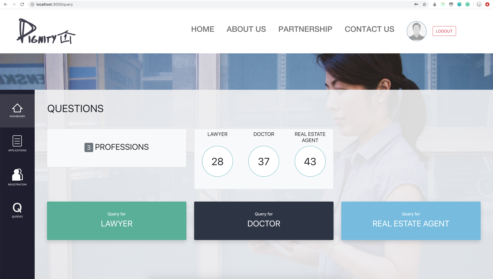

### Dignity First (Client)

1) npm install -g concurrently

2) npm run install-all    (may take some time)

3) npm run dev

------

####  1. Basic structure

update on: 13/04/2020

#### 2. Header (responsive)

update on: 16/04/2020

#### 3.Sidebar

update on 21/04/2020

- employ "bootstrap" and "reactstrap" library
- add a sidebar

#### 4.Login Page

update on 21/04/2020

#### 5.Query Page

update on 26/04/2020

1. remove pure css implemented header, employ "navbar" in Bootstrap instead, to increase simplicity

2. query page overview
3. click the button to the "specific questions page"

#### 6.Query Questions

update on 30/04/2020

1. fake queries displaying in table format
2. add query 
3. edit query

----

#### 7. Combine together

update on 05/05/2020

Login Page

Dashboard Page

Query Page

#### 8. Application & Registration static page

update on 07/05/2020

Application Page

Registration Page

#### 9.Updates

upate on 11/05/2020

add  financial services

list state up, "query overview page" and "query questions page" are able to share the "occupation_queries".

#### 10. Registration and Application

upate on 14/05/2020

1. Registration Page adds pop-up window to show  registration details
2. Application Page adds pop-up window to show application details and is able to forward to somebody with email

